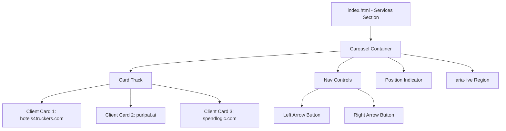

# Design Document: Client Carousel

## Overview

The client carousel adds a horizontally-navigable showcase of "baseball card" style client cards to the Services section of the Cadocary homepage. It establishes social proof by displaying previous client engagements (hotels4truckers.com, purlpal.ai, spendlogic.com) in a visually consistent, accessible, and responsive component.

The implementation is purely static HTML + CSS with minimal vanilla JavaScript for navigation logic, consistent with the existing site architecture (no frameworks, no bundler, no external dependencies).

### Design Decisions

1. **Single-card-at-a-time navigation with responsive multi-card display**: On mobile (≤600px), the carousel shows one card at a time with prev/next arrows. On tablet (601–900px), two cards are shown. On desktop (>900px), all three cards are visible simultaneously. Navigation controls are only relevant when fewer cards are visible than exist.

2. **CSS custom properties only**: All colors reference existing `:root` variables from cadocary.css. No hardcoded color literals.

3. **Progressive enhancement**: The carousel is fully functional without JavaScript when all cards are visible (desktop). JS only powers the navigation interaction on smaller viewports.

4. **No external dependencies**: Vanilla JS carousel logic (~50 lines), no libraries.

## Architecture



### Component Hierarchy

```
section#services (existing)
└── .carousel[role="region"][aria-label="Client showcase"]
    ├── .carousel-track
    │   ├── .carousel-card (hotels4truckers.com)
    │   ├── .carousel-card (purlpal.ai)
    │   └── .carousel-card (spendlogic.com)
    ├── .carousel-nav
    │   ├── button.carousel-prev[aria-label="Previous client"]
    │   └── button.carousel-next[aria-label="Next client"]
    ├── .carousel-indicator (e.g., "2 of 3")
    └── .carousel-live[aria-live="polite"] (screen reader announcements)
```

## Components and Interfaces

### HTML Structure (added below existing Services section content)

The carousel is injected into `index.html` inside `section#services`, after the existing `.hero-right` panel. It sits below the current services content within the same `<section>` element.

### Client Card Component

Each `.carousel-card` extends the existing `.card` class from cadocary.css and adds carousel-specific layout:

```html
<article class="card carousel-card">
  <h3 class="carousel-card-name">{project name}</h3>
  <p class="carousel-card-contact">{contact name}</p>
  <a class="carousel-card-email" href="mailto:{email}">{email}</a>
  <p class="carousel-card-desc">{description}</p>
</article>
```

Field order (top to bottom): project name → contact name → contact email → description.

### Navigation Controls

```html
<div class="carousel-nav">
  <button class="carousel-prev" aria-label="Previous client">&#8592;</button>
  <button class="carousel-next" aria-label="Next client">&#8594;</button>
</div>
```

Buttons use Unicode arrows (← →) for no-dependency iconography. They receive focus styling from existing link/button patterns and meet the 44×44px minimum tap target.

### JavaScript Interface

```javascript
// Carousel state
const state = { currentIndex: 0, totalCards: 3, visibleCards: 1 };

// Functions
function updateCarousel()    // Applies translateX to .carousel-track
function nextCard()          // Advances index (wraps at end)
function prevCard()          // Decrements index (wraps at start)
function getVisibleCards()   // Returns 1, 2, or 3 based on viewport width
function updateIndicator()   // Updates "X of Y" text
function updateLiveRegion()  // Announces current card to screen readers
function updateNavVisibility() // Hides controls when all cards visible
```

### CSS Classes (added to cadocary.css)

| Class | Purpose |
|-------|---------|
| `.carousel` | Container with `role="region"`, flex column layout |
| `.carousel-track` | Horizontal flex container, transition on transform |
| `.carousel-card` | Extends `.card`, fixed width per breakpoint |
| `.carousel-card-name` | Project name heading (h3), bold/larger text |
| `.carousel-card-contact` | Contact name, muted text |
| `.carousel-card-email` | mailto link, accent color |
| `.carousel-card-desc` | Description paragraph |
| `.carousel-nav` | Flex row for prev/next buttons |
| `.carousel-prev`, `.carousel-next` | Navigation buttons, 44×44px minimum |
| `.carousel-indicator` | Position text ("2 of 3") |
| `.carousel-live` | Visually hidden, `aria-live="polite"` |

## Data Models

The client data is hardcoded in HTML (static site, no build step). The logical model for each card:

```
ClientCard {
  projectName: string    // e.g., "hotels4truckers.com"
  contactName: string    // e.g., "Dan Fuller"
  contactEmail: string   // e.g., "dan@hotels4truckers.com"
  description: string    // e.g., "A booking platform for..."
}
```

### Client Data (static)

| Project | Contact | Email | Description |
|---------|---------|-------|-------------|
| hotels4truckers.com | Dan Fuller | dan@hotels4truckers.com | A booking platform for hotels with trucker-friendly parking, on web and mobile |
| purlpal.ai | Andy Barr | el.andy.barr@gmail.com | A RAG-enabled chatbot over Medicare Advantage plans, and associated webscraping |
| spendlogic.com | Adam Shovav | adam@thedreamers.us | A procurement compliance documentation templating engine |

### Carousel State

```
CarouselState {
  currentIndex: number      // 0-based index of first visible card
  totalCards: number        // Always 3 for current dataset
  visibleCards: number      // 1, 2, or 3 depending on viewport
}
```

Transition: `transform: translateX(-${currentIndex * (100 / visibleCards)}%)` on `.carousel-track`, with `transition: transform 300ms ease`.


## Correctness Properties

*A property is a characteristic or behavior that should hold true across all valid executions of a system—essentially, a formal statement about what the system should do. Properties serve as the bridge between human-readable specifications and machine-verifiable correctness guarantees.*

### Property 1: Viewport breakpoint mapping

*For any* viewport width (positive integer), `getVisibleCards(width)` SHALL return 1 when width ≤ 600, 2 when 601 ≤ width ≤ 900, and 3 when width > 900.

**Validates: Requirements 1.4, 1.5, 1.6, 5.2**

### Property 2: Next navigation wrapping

*For any* currentIndex in [0, totalCards - 1] and any totalCards ≥ 1, calling `nextCard()` SHALL set currentIndex to `(currentIndex + 1) % totalCards`.

**Validates: Requirements 3.2, 3.4**

### Property 3: Previous navigation wrapping

*For any* currentIndex in [0, totalCards - 1] and any totalCards ≥ 1, calling `prevCard()` SHALL set currentIndex to `(currentIndex - 1 + totalCards) % totalCards`.

**Validates: Requirements 3.3, 3.5**

### Property 4: Position indicator accuracy

*For any* currentIndex in [0, totalCards - 1], the position indicator text SHALL equal `"${currentIndex + 1} of ${totalCards}"`.

**Validates: Requirements 3.6**

### Property 5: Aria-live region update on navigation

*For any* navigation action (next or prev) from any valid currentIndex, the aria-live region SHALL be updated with non-empty text that includes the name of the newly visible client card.

**Validates: Requirements 6.5**

## Error Handling

Since this is a static HTML component with minimal JS, error scenarios are limited:

| Scenario | Handling |
|----------|----------|
| JavaScript disabled | Carousel displays all cards in a stacked/grid layout (CSS-only fallback). Navigation controls hidden via `<noscript>` or JS-added class. |
| Zero cards rendered (hypothetical) | Navigation controls hidden per requirement 3.7. Indicator shows "0 of 0". |
| Rapid-fire clicks | CSS `transition` handles animation; JS updates state synchronously so rapid clicks simply advance quickly without breaking state. |
| Viewport resize mid-navigation | `resize` event listener recalculates `visibleCards` and clamps `currentIndex` to valid range. |

### Defensive Measures

- `currentIndex` is always clamped: `Math.max(0, Math.min(currentIndex, totalCards - visibleCards))`
- Navigation buttons use `<button>` elements (not divs) for native keyboard and accessibility support
- No external network requests — all data is inline HTML

## Testing Strategy

### Unit Tests (Example-Based)

Verify specific, fixed behaviors:

1. **Card content**: Each of the 3 cards renders correct project name, contact, email, and description
2. **Card structure**: Fields appear in correct DOM order (name → contact → email → description)
3. **Email links**: Each email is a `<a href="mailto:...">` with visible email text
4. **Accessibility attributes**: Container has `role="region"` and `aria-label`; buttons have `aria-label`
5. **CSS class application**: Cards have `.card` class; carousel styles exist in cadocary.css
6. **Tap target size**: Navigation buttons meet 44×44px minimum
7. **Keyboard operability**: Enter/Space on buttons triggers navigation
8. **Navigation visibility**: Controls hidden when totalCards < 2

### Property-Based Tests

Using **fast-check** (JavaScript PBT library) with minimum 100 iterations per property:

| Property | Generator | Assertion |
|----------|-----------|-----------|
| 1: Viewport breakpoint | `fc.integer({min: 1, max: 5000})` | Correct visible count per breakpoint rules |
| 2: Next wrapping | `fc.record({currentIndex: fc.integer, totalCards: fc.integer({min:1, max:100})})` | `(idx + 1) % total` |
| 3: Prev wrapping | Same as above | `(idx - 1 + total) % total` |
| 4: Indicator text | `fc.record({currentIndex: fc.integer, totalCards: fc.integer({min:1, max:100})})` | String matches `"X of Y"` format |
| 5: Aria-live update | `fc.record({currentIndex: fc.integer, direction: fc.constantFrom('next','prev')})` | Live region text is non-empty and contains card name |

Each property test tagged with: `// Feature: client-carousel, Property N: {description}`

### Integration Tests

- Visual check at 3 viewport widths (400px, 750px, 1200px) confirming correct card count visible
- Full carousel cycle: next→next→next returns to first card
- Responsive resize: shrinking viewport below 600px switches to single-card mode with controls visible

### Test Runner

Tests run with a lightweight test runner (e.g., Vitest with jsdom) since the project has no existing test infrastructure. Configuration:
- `vitest` + `jsdom` environment for DOM testing
- `fast-check` for property-based tests
- No watch mode in CI (`vitest --run`)
