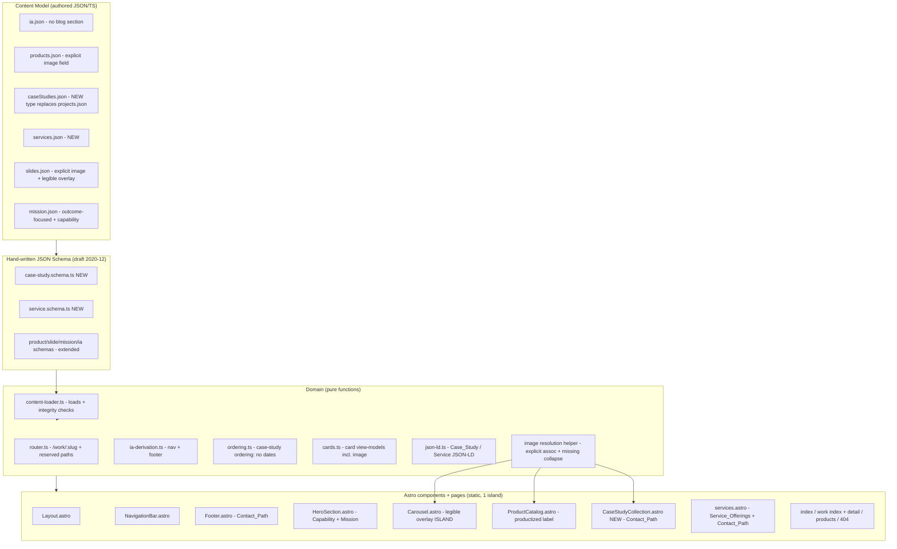

# Design Document

## Overview

This feature is a CMO/PR/copywriting-led content and positioning overhaul layered **on top of** the existing Astro + TypeScript static site at `cadocary-site/` (the prior `website-redesign` implementation). It changes what the site *says* and *shows*, not how the platform is built. Nothing in the build system, the routing core (`src/domain/router.ts`), the hydrated carousel island (`Carousel.astro` + `src/domain/carousel.ts`), the IA-derivation model, the design-token system, or the hand-written JSON-Schema + JSON-LD approach is re-architected. Instead we **extend** the content model, **repurpose** existing templates, **introduce a Case_Study content type**, **fix image-to-content correspondence**, **make the hero legible**, **remove the blog**, and **fill out Services** — reusing every load/validate/derive/render mechanism already in place.

The site's audience is the **Evaluator**: a government/enterprise procurement reader assessing an RFP response. The site's job is to make that reader confident Cadocary can deliver serious custom software. The current site fails that job on content grounds:

1. It reads like a catalog of small desktop tools and buries the substantial custom software Cadocary built for clients.
2. It presents client engagements (`projects.json`) as blog-style, date-ordered entries rather than outcome-focused case studies.
3. Its Services page is essentially empty.
4. The hero carousel places overlay text over busy screenshots (poor legibility) and shows the *wrong* image for a product (DocketBot and ClientCheck slides both use the Highlighter screenshot).
5. It ships a blog that dilutes the corporate focus.

### What changes vs. what is preserved

| Area | Change | Preserved mechanism |
| --- | --- | --- |
| Client work | Reframe `projects` → **Case_Study** content type with structured `problem / approach / whatWasBuilt / outcome` sections, client link-out, proof points, and a **`cadocaryRole`** field flagged for user confirmation | The `/projects/*` route family, `getStaticPaths`, `ContentBody`, JSON-LD emission, ordering-as-permutation, empty-state handling |
| Positioning | New **Capability_Statement** on the home page; outcome-focused **Mission_Statement** rewrite | `mission.json` + `ContentBody` + `HeroSection` graceful-degradation |
| Services | Real **Service_Offering** entries with outcome copy, Case_Study proof links, and `mailto` contact | New `services.json` content doc validated by the existing loader/validator |
| Products | Correct DocketBot/ClientCheck **images**; label as productized offerings distinct from case studies | `products.json`, `ProductCatalog.astro`, `orderProducts` |
| Hero | Legible **overlay treatment**: a **transparent gradient banner (scrim)** spanning the hero behind the overlay text, token-driven, contrast ≥ 4.5:1 regardless of the background image; explicit per-slide image association | `Carousel.astro` island, `slides.json`, `slide-deck.schema.ts` |
| Images | Every Slide/Product/Case_Study carries an **explicit image field**; graceful missing-image collapse; required alt text | Existing `public/img/*` assets + the two new `public/img/case-studies/*.jpg` demo thumbnails |
| Blog | **Remove** `blog.ts`, `src/pages/blog/`, the `blog` IA section, all blog routes/links | Router reserved/unknown → 404 behavior; IA-derived nav/footer |
| IA | Sections become **Products, Services, Work (Case Studies), About/Contact** — no blog | `ia.json`, `ia-derivation.ts`, content-loader integrity checks |
| Exclusions | Keep no search/login/registration; reserved paths → 404 | `resolveRoute` reserved-path precedence, 404 page |

### Cadocary's role (CONFIRMED) — a consultancy positioning that shapes the whole site

Cadocary's role has been **confirmed by the user** and is consistent across every engagement: **Cadocary is a software design and implementation consultancy that provides white-glove, end-to-end service for product implementation that is better and cheaper at once.** This is not merely a per-case-study detail — it is the site's core positioning and must inform the Capability_Statement, the Services offering, and each case study's framing.

Concretely, this positioning drives three things:

1. **Capability_Statement / Mission (home page):** frames Cadocary as a design-and-implementation consultancy delivering end-to-end product implementation — better *and* cheaper — for organizations, not just a vendor of small tools. The "better and cheaper at once" value proposition is the throughline.
2. **Services offering:** the Service_Offerings describe Cadocary's consultancy model — design through implementation, delivered end-to-end (white-glove) — evidenced by the case studies. Each case study is proof that Cadocary took a client's product from design to a shipped, working implementation.
3. **Per-case-study `engagementRole`:** every Case_Study shares the same confirmed consultancy role (design + implementation, end-to-end white-glove) while the **project-specific deliverable** (what was actually built) varies per client. The shared role is confirmed; only the specific built artifact per engagement is drawn from source material.

Per-engagement built artifact (the *what*, distinct from the confirmed consultancy *role*; drawn from existing/live-site source material, refine copy as needed):

- **SpendLogic** — Cadocary designed and implemented, end-to-end, a procurement-compliance documentation templating engine (SpendLogic's product domain: CPSR documentation for federal contractors/agencies).
- **hotels4truckers** — Cadocary designed and implemented, end-to-end, the booking platform across web and native iOS/Android mobile apps.
- **purlpal** — Cadocary designed and implemented, end-to-end, a RAG-enabled chatbot over Medicare Advantage plans plus the associated webscraping (original RAG-chatbot framing only; **do NOT** use the current "CoachPal real-time call compliance" material).

Client-published metrics remain attributed to the **client** (e.g. "SpendLogic reports…"), never claimed as Cadocary's own.

## Architecture

The site keeps its established layered, static-first architecture. This feature adds one content type and one content document and modifies presentation copy/templates; it introduces no new architectural layer.



### Key architectural decisions

**1. Rename the "projects" concept to "Case_Study" at the content and presentation layers, keep the routing shape.**
The existing `projects.json` / `Project` type / `/projects/*` route family is repurposed into a `Case_Study` content type. To minimize churn and keep the router's parameterized-detail mechanism intact, the *route family* is renamed to `/work/:slug` (outcome-oriented, not "projects" and not "blog"), and the content document becomes `caseStudies.json`. The router's generic `extractSlug(path, prefix)` mechanism already supports this — only the prefix constant and IA paths change. Ordering is changed from date-descending to a **date-free stable permutation** (Requirement 4.6): case studies must have no per-item publication date and no reverse-chron ordering.

**2. Image-content correspondence is enforced by an explicit `image` association on every visual entity.**
The current image bug (DocketBot/ClientCheck slides both using `highlighter-screenshot.png`) exists because slides carry a free-form `image.src` with no link to the product/case study they illustrate. The fix is structural: every Slide that references a Product or Case_Study carries a **`ref`** (the referenced entity id) and the render layer resolves the image from that entity's explicit `image` field, or the slide supplies its own explicit `image` that the design pins to the correct asset. A single pure `resolveImage` helper (new, in `src/domain/images.ts`) centralizes: "given an entity with an optional explicit image, return the asset to render, or signal 'no image' so the layout collapses the image space." This makes correspondence a checkable property rather than an authoring accident.

**3. Services becomes a validated content document, not hard-coded page copy.**
Today `services.astro` hard-codes a single "pitch an idea" block. This feature introduces `services.json` (a `Service_Offering[]`), validated by a new `service.schema.ts` through the *existing* loader, and rendered by the Services page. Each offering can link to a Case_Study as proof; the link target resolves through the same router, so a missing target yields the standard 404 (Requirement 3.9).

**4. Blog removal is a deletion + IA edit; the router already does the rest.**
Removing `blog.ts`, `src/pages/blog/`, and the `blog` IA section means: no blog pages are generated, nav/footer (derived purely from the IA) automatically drop blog links, and any previously-existing blog URL resolves through `resolveRoute` to `not-found` → the 404 page. No router code changes are required for blog URLs to 404 — they become "unknown" paths. The content-loader integrity checks continue to guarantee the IA is internally consistent.

**5. Hero legibility is a transparent gradient banner (scrim) inside the existing island.**
The Carousel island is unchanged behaviorally. The overlay caption is rendered over a **transparent gradient banner** — a semi-transparent gradient band that spans the hero behind the overlay text (e.g. transitioning from a stronger dark stop under the text to fully transparent toward the opposite edge), driven by design tokens. The gradient banner is composited between the background image and the text on every slide, so the text sits on a known darkened band rather than directly on raw image pixels. This keeps overlay text legible even when the pixels behind it are light, high-detail, or themselves contain text (e.g. a screenshot), and makes the effective contrast against the pixels directly behind the text ≥ 4.5:1 (≥ 3:1 for large/bold text) **independent of the background image content**. Heading/supporting text are clamped to a max line count with ellipsis and kept within slide bounds and clear of controls. Because the gradient banner — not the image — is what sits directly behind the text, contrast no longer depends on the image content, which is what makes Requirement 5 satisfiable deterministically.

### Routing and page resolution (unchanged core, updated data)

`resolveRoute` continues to (1) reject reserved paths first, (2) match exact IA pages, (3) match parameterized detail routes, (4) 404 otherwise. Changes are data-only:

- Product detail prefix stays `/products/`.
- Project detail prefix `/projects/` becomes **`/work/`** (Case_Study detail).
- Blog paths are simply absent from the IA and unmatched by any prefix → `not-found` (unknown).
- `/search`, `/login`, `/register` remain reserved → `not-found` (reserved).

## Components and Interfaces

### Information Architecture (`ia.json` + `ia-derivation.ts`)

The IA is edited to remove the `blog` section and reframe sections around the Evaluator's assessment path. Nav and footer both derive from it via the unchanged `buildNavModel` / `buildFooterDirectory`.

Target top-level sections (order preserved as authored):

- **Home** (`/`)
- **Products** — `/products` (All Products), `/products/docketbot`, `/products/clientcheck`, `/highlighter/` (external productized offering)
- **Services** — `/services`
- **Work** (Case Studies) — `/work` (index), `/work/spendlogic`, `/work/hotels4truckers`, `/work/purlpal`
- **About** — `/contact`

No `blog` section, no blog page entries (Requirement 7.7). Section/page labels use outcome-oriented, non-technical language; the "Work" section is labeled with client-outcome language, never "posts"/"articles" (Requirement 4.6).

Interfaces: no signature changes to `buildNavModel(ia)`, `buildFooterDirectory(ia)`, `getActiveSection(ia, current, by)`.

### Navigation Bar (`NavigationBar.astro`)

Unchanged component; its content changes automatically because it derives from the edited IA. Presents Services, Work (Case Studies), and Products as reachable top-level items (Requirement 1.3). Zero blog entries (Requirement 7.2).

### Footer (`Footer.astro`)

Unchanged derivation. Gains the **Contact_Path**: the footer renders a `mailto:mail@cadocary.com` link whose visible text is the literal address `mail@cadocary.com` (Requirements 1.5, 9.1, 9.2, 9.4). Zero blog links (Requirement 7.3).

### Hero Section (`HeroSection.astro`) + Capability_Statement + Mission_Statement

`HeroSection` continues to stack the Carousel island above static copy. This feature adds the **Capability_Statement** as static, above-the-fold server HTML (no interaction required to see it — Requirements 1.1, 2.1) and rewrites the Mission_Statement copy to be outcome-focused (Requirement 1.2).

- The Capability_Statement lives in the content model as a new field on `mission.json` (`capability`: a heading + `ContentBlock[]`) so it is validated and degrades gracefully (Requirements 1.8, 2.6): if it fails to load, placeholder text renders while the reserved above-the-fold space is preserved.
- The Capability_Statement copy names **at least 3 distinct concrete capabilities** — e.g. *web platforms, native mobile apps, data pipelines, AI/ML integration, automation* — each a concrete capability, not a subjective qualifier (Requirement 2.4). It identifies Cadocary as a builder of custom software for organizations (Requirement 1.1).
- Home-page top-level content sections each get a heading + introductory sentence and a CTA to their detail area (Requirements 1.6, 8.3, 9.5, 9.6): a Services CTA → `/services`, a Case Studies CTA → `/work`.

Interface: `HeroSection` gains an optional `capability?: CapabilityStatement | null` prop alongside the existing `mission`.

### Carousel (`Carousel.astro`) — legibility treatment

Behavioral logic (`src/domain/carousel.ts`) is untouched. The caption markup and styles change:

- The `.carousel__caption` renders over a **transparent gradient banner (scrim)**: a semi-transparent gradient band spanning the hero, composited between the background image and the text using design tokens (e.g. a dark gradient stop under the text fading to transparent), sized to cover the text region. Because the gradient banner sits directly behind the text, the effective contrast against the pixels directly behind the text is ≥ 4.5:1 (≥ 3:1 for large/bold text) **independent of the image content** — including when the background image is light or contains text (Requirements 5.1, 5.2, 5.6).
- If the chosen gradient treatment does not reach the target ratio, the design specifies increasing the gradient banner's opacity (its darkest stop) in ≤ 10% steps up to 100% until contrast is met, keeping text visible (Requirement 5.3). In practice the default gradient tokens are chosen to already meet the ratio; the stepping rule is the documented fallback contract.
- Heading and supporting overlay text are wrapped within slide bounds and truncated with a trailing ellipsis after at most 3 lines each (`-webkit-line-clamp`), never overflowing the slide or overlapping the prev/next/dots controls, across viewport widths 320–3840px (Requirements 5.4, 5.5).
- Overlay text uses the site typography scale and color tokens, applied identically across all slides (Requirement 5.6).

### Product Catalog (`ProductCatalog.astro`) — productized label + correct images

- Products are presented under a **visible "Products" / productized-offerings label**, distinct from the Case Studies label (Requirement 2.2). Every presented engagement appears in exactly one of Products or Case Studies (Requirement 2.3): DocketBot, ClientCheck, Highlighter are Products; SpendLogic, hotels4truckers, purlpal are Case Studies.
- Each product renders its **explicitly associated image** via `resolveImage` (Requirement 6.2). Image mapping:
  - DocketBot → `/img/case-studies/docketbot-demo.jpg` (the correct 1280×720 demo thumbnail).
  - ClientCheck → `/img/case-studies/clientcheck-demo.jpg`.
  - Highlighter → `/img/highlighter-screenshot.png`.
- Cards keep name (≤ 120 chars) + summary (≤ 300 chars) + CTA (Requirements 2.5, 8.6). Missing images collapse gracefully (Requirement 6.5).

### Case Study Collection (`CaseStudyCollection.astro`, NEW) + detail pages

Replaces the blog-style project presentation. Rendered from `caseStudies.json` via a date-free ordering.

- **Collection** (`/work`, backed by a repurposed index page): one card per Case_Study with title (≤ 120), summary (≤ 300), associated image, and a link to `/work/{slug}` (Requirements 4.1, 4.3). **No per-item dates, no reverse-chron ordering**; section + item labels use client-outcome language, never "posts"/"articles" (Requirement 4.6). The collection presents the **Contact_Path** `mailto:mail@cadocary.com` (Requirements 9.1, 9.2, 9.4). Empty collection → explicit "no case studies currently available" message (Requirement 4.8).
- **Detail** (`/work/{slug}`, repurposed `[slug].astro`): renders the four structured sections **Problem → Approach → What was built → Outcome**, the client name and **client site link-out** (to the live client site), optional outcome/proof points, and Cadocary's role — the confirmed consultancy `engagementRole` (design + implementation, end-to-end white-glove, better and cheaper) plus the engagement-specific `deliverable`. Client-published metrics are labeled as the **client's** results (e.g. "SpendLogic reports…"), not Cadocary's (Requirement 4.2, 4.5). Unavailable detail content stays on the page (or a dedicated fallback) with a message, never a blank/broken page (Requirement 4.7). Emits Case_Study JSON-LD (a `CreativeWork`) via the existing thin derivation.

### Services Page (`services.astro`) — real offering

Rendered from the new `services.json`:

- Presents 1–20 **Service_Offering** entries, each with a name (≤ 120) and outcome-focused descriptive copy (80–600 chars) describing delivered software and client outcomes; forbids the standalone claims "best"/"world-class"/"cutting-edge" (Requirements 3.1, 3.2, 3.6). Positions Cadocary as a builder of serious custom software (web platforms, mobile apps, data pipelines, AI/ML integration, automation), with the desktop tools presented as productized offerings distinct from custom engagements.
- Presents at least one link resolving to the Case_Study_Collection or a specific Case_Study as proof (Requirement 3.3); where an offering maps to a case study, it links to that case study, otherwise it renders without a broken/empty link (Requirements 3.7, 3.8). A case-study link to an unavailable target yields a 404 (Requirement 3.9).
- Presents the **Contact_Path** as `mailto:mail@cadocary.com` with the literal address as visible text (Requirements 3.4, 3.5, 9.2, 9.4).

### Image resolution helper (`src/domain/images.ts`, NEW)

A small pure module centralizing image-content correspondence and missing-image handling:

```ts
export type ResolvedImage =
  | { kind: "image"; src: string; alt: string }
  | { kind: "none" }; // caller collapses the image space, no broken ref

// Resolve the image to render for a visual entity, given its explicit
// association. `alt` falls back to "" when missing (never a filename/path/token).
export function resolveImage(input: {
  image?: { src?: string; alt?: string };
}): ResolvedImage;

// Resolve a slide's image by its explicit `image` or by the referenced entity's
// explicit `image` (Product/Case_Study), never another entity's image.
export function resolveSlideImage(
  slide: Slide,
  byId: (ref: string) => { image?: { src: string; alt: string } } | undefined,
): ResolvedImage;
```

Rules encoded: an entity renders its own explicitly-associated asset and never another entity's (Requirements 6.1–6.3); a missing image returns `{ kind: "none" }` so the caller collapses the reserved image area and renders the text at the same position/size/styling (Requirement 6.5); alt text falls back to empty string and never exposes a filename, path, or placeholder token (Requirement 6.6); when present, alt text is 1–125 chars naming the specific subject (Requirement 6.4, enforced by schema bounds on authored content).

### Router (`router.ts`) — data-only change

Change the project detail prefix constant to `/work/` (Case_Study detail) and rename the result variant accordingly (`kind: "caseStudy"`). Reserved-path precedence and unknown → not-found are unchanged. Blog URLs are unknown paths → 404.

## Data Models

All models remain authored JSON validated by hand-written draft 2020-12 schemas through the existing `loadContent` loader, with Schema.org-aligned public fields emitted as JSON-LD and internal bookkeeping fields retained but never emitted.

### ContentBlock (unchanged)

The existing atomic block union (`paragraph | heading | image | list`) is reused for all rich copy, including Case_Study section bodies.

### Case_Study (NEW — replaces Project)

```ts
export type CaseStudySection = {
  /** One of the four fixed section kinds. */
  kind: "problem" | "approach" | "whatWasBuilt" | "outcome";
  /** Section copy as reusable content blocks. */
  body: ContentBlock[];
};

export type ProofPoint = {
  /** e.g. "20:1 ROI", "100% CPSR pass rate since 2016". */
  label: string;
  /** Optional supporting detail. */
  detail?: string;
  /** Attribution — client-published metrics are attributed to the client. */
  attribution: "client" | "cadocary"; // seed data uses "client" for client metrics
};

export type CaseStudy = {
  // --- Schema.org CreativeWork-aligned (public / emitted as JSON-LD) ---
  /** schema.org: name (the case study title). <= 120 chars. */
  name: string;
  /** schema.org: description (the summary). <= 300 chars. */
  description: string;
  /** schema.org: image — the explicitly associated asset. */
  image?: { src: string; alt: string }; // alt 1..125 chars when present
  /** schema.org: url — canonical detail URL (/work/{slug}). */
  url?: string;

  // --- Case-study-specific fields ---
  /** Client organization name, e.g. "SpendLogic". */
  clientName: string;
  /** Live client site to link OUT to, e.g. "https://spendlogic.com". */
  clientSiteUrl: string;
  /**
   * Cadocary's engagement role. CONFIRMED and consistent across all case
   * studies: a software design & implementation consultancy providing
   * white-glove, end-to-end product implementation that is better and cheaper
   * at once. Authored from a shared constant so every case study is consistent.
   */
  engagementRole: string;
  /**
   * The project-specific deliverable Cadocary designed and implemented for this
   * engagement (the *what*, distinct from the shared consultancy role above),
   * e.g. "an end-to-end booking platform on web and native iOS/Android apps".
   */
  deliverable: string;
  /** The four structured sections, in fixed problem→approach→built→outcome order. */
  sections: CaseStudySection[];
  /** Optional outcome/proof points (client metrics attributed to the client). */
  proofPoints?: ProofPoint[];

  // --- Internal bookkeeping (not emitted as structured data) ---
  /** Stable id. */
  id: string;
  /** URL slug -> detail path /work/{slug}. */
  slug: string;
  /** Stable ordering key (NOT a date). */
  order: number;
  /** References PageRef.id in ia.json. */
  detailPageId: string;
};
```

Key differences from the old `Project`: **no `dateCreated`** (Requirement 4.6 forbids per-item dates and date ordering); adds `clientName`, `clientSiteUrl`, `cadocaryRole` (+ confirmation flag), the fixed four-section `sections` array, and optional `proofPoints`; adds an `order` integer used for a stable, date-free ordering.

Schema bounds (`case-study.schema.ts`, NEW): `name` maxLength 120; `description` maxLength 300; `image.alt` minLength 1 / maxLength 125; `sections` requires each of the four `kind`s exactly once; `clientSiteUrl` a URL string; required internal keys `id`, `slug`, `order`, `detailPageId`.

### Seed content (fact-grounded; roles flagged)

All three share the same confirmed `engagementRole` (authored from one shared constant): *"Cadocary served as the software design and implementation consultancy, delivering white-glove, end-to-end product implementation — better and cheaper at once."* Only the per-engagement `deliverable` and domain detail differ:

- **spendlogic** — clientName "SpendLogic", clientSiteUrl `https://spendlogic.com`, image `/img/spendlogic-screenshot.png`. Domain: procurement-documentation compliance software for federal contractors/agencies subject to CPSR. `proofPoints` (attribution: client): "20:1 ROI", "100% CPSR pass rate since 2016", "50 years GovCon experience", "ERP integration"; solution notes: SpendFile documentation folders, price analysis, source justifications, FedRAMP version for government agencies. `deliverable`: "an end-to-end procurement-compliance documentation templating engine."
- **hotels4truckers** — clientName "hotels4truckers", clientSiteUrl `https://hotels4truckers.com`, image `/img/hotels4truckers-screenshot.png`. Domain: booking platform + native iOS/Android apps for truckers to find hotels with tractor-trailer parking (up to 75ft), 10–15% discounts, free membership, rate comparison, booking engine, trucker-friendly hotel database built from scratch. `deliverable`: "an end-to-end booking platform across web and native iOS/Android mobile apps."
- **purlpal** — clientName "purlpal", clientSiteUrl `https://purlpal.ai`, image `/img/purlpal-screenshot.png`. Domain (ORIGINAL RAG framing only): a RAG-enabled chatbot over Medicare Advantage plans plus associated webscraping. `deliverable`: "an end-to-end RAG-enabled chatbot over Medicare Advantage plans, plus the associated webscraping." Do **not** use CoachPal real-time-call-compliance material.

### Service_Offering (NEW)

```ts
export type ServiceOffering = {
  /** Display name of the service. <= 120 chars. */
  name: string;
  /** Outcome-focused copy: what Cadocary does for the client. 80..600 chars. */
  description: string;
  /** Optional id of a Case_Study that evidences this offering. */
  caseStudyRef?: string; // resolves to /work/{slug}; absent -> no proof link
  // --- Internal bookkeeping ---
  id: string;
  order: number;
};

export type ServicesPage = {
  offerings: ServiceOffering[]; // 1..20
};
```

Schema (`service.schema.ts`, NEW): `name` maxLength 120; `description` minLength 80 / maxLength 600; `offerings` minItems 1 / maxItems 20. (The "no best/world-class/cutting-edge" rule is copy guidance enforced by test, since a schema cannot cleanly forbid substrings without false positives; see Testing Strategy.)

### Product (extended)

The existing `Product` type is unchanged in shape but the **`image` field becomes the single source of the product's picture** and is populated for DocketBot and ClientCheck with the correct demo thumbnails (fixing the current mismatch, which lived in slides). No new required fields. `image.alt` guidance: 1–125 chars naming the product.

Corrected image mapping (authored into `products.json`):

| Product | image |
| --- | --- |
| DocketBot | `/img/case-studies/docketbot-demo.jpg` |
| ClientCheck | `/img/case-studies/clientcheck-demo.jpg` |
| Highlighter | `/img/highlighter-screenshot.png` |

### Slide (extended for correspondence + legibility)

```ts
export type Slide = {
  id: string;
  /** Explicit image association. Missing -> image space collapses. */
  image?: { src: string; alt: string }; // alt 1..125 when present
  /** Optional reference to the Product/Case_Study this slide illustrates. */
  ref?: string; // when set, image resolves from the referenced entity if slide.image absent
  heading: string;
  text?: string;
  cta?: { label: string; pageId: string; path: string };
};
```

Corrected slide image mapping (fixes DocketBot/ClientCheck both using the Highlighter screenshot):

| Slide | ref | resolved image |
| --- | --- | --- |
| tagline | — | `/gilbreth-quote.png` (own explicit image) |
| DocketBot | `docketbot` | `/img/case-studies/docketbot-demo.jpg` |
| ClientCheck | `clientcheck` | `/img/case-studies/clientcheck-demo.jpg` |
| Services | — | a services-appropriate asset (own explicit image), not a mismatched screenshot |

`slide-deck.schema.ts` is extended to make `image` optional and add the optional `ref`; the existing 2–10 slides / 5–8s interval bounds are unchanged.

### Mission (extended with Capability_Statement)

```ts
export type CapabilityStatement = {
  heading: string;
  body: ContentBlock[]; // names >= 3 concrete capabilities
};

export type Mission = {
  heading: string;
  body: ContentBlock[];          // outcome-focused rewrite
  capability?: CapabilityStatement; // NEW; degrades gracefully if absent
};
```

`mission.schema.ts` is extended with the optional `capability` object. If `capability` is absent/unloadable, the home page shows placeholder text while preserving the reserved above-the-fold layout (Requirements 1.8, 2.6).

### IA (`ia.json`) — shape unchanged, content changed

The `IA`/`Section`/`PageRef` types are unchanged. The document is edited to remove the `blog` section and its pages, rename the "projects" section to **Work** with `/work/*` paths, and keep Products/Services/About. Content-loader integrity checks (unique id/path, each page in one section, valid `defaultSectionId`, no reserved path) continue to apply and must pass post-edit.

### Content source wiring (`content-loader.ts`)

`ContentSource` / `ContentBundle` gain `services` and rename `projects` → `caseStudies`:

```ts
export interface ContentSource {
  ia: unknown; products: unknown; caseStudies: unknown;
  services: unknown; slideDeck: unknown; mission: unknown;
}
export interface ContentBundle {
  ia: IA; products: Product[]; caseStudies: CaseStudy[];
  services: ServicesPage; slideDeck: SlideDeck; mission: Mission;
}
```

The loader's per-document validation and IA integrity logic are otherwise unchanged; it validates the two new/renamed documents through the same `validate(doc, schema)` path.

## Correctness Properties

*A property is a characteristic or behavior that should hold true across all valid executions of a system — essentially, a formal statement about what the system should do. Properties serve as the bridge between human-readable specifications and machine-verifiable correctness guarantees.*

This feature's core logic is well suited to property-based testing: the site's pure domain functions (image resolution, routing, ordering, IA derivation, card/JSON-LD derivation, content validation) have clear input/output behavior over large input spaces. The existing suite already uses `fast-check`; these properties **extend** it (and migrate the now-invalid project date-ordering property to the date-free case-study ordering). Copy quality, above-the-fold timing, token/layout consistency, and blog-file removal are covered by example, smoke, and integration tests in the Testing Strategy — not property tests.

The following properties were derived from the prework analysis (redundant criteria were consolidated as noted there).

### Property 1: Unavailable, removed, or unknown paths resolve to not-found

*For any* URL path that is neither a reserved path, nor an exact IA page, nor a valid `/products/{slug}` or `/work/{slug}` detail slug — including every previously-existing blog path (`/blog`, `/blog/{anything}`) and any unavailable Case_Study/collection target — `resolveRoute` returns a `not-found` result (rendered as the 404 page with nav and footer, never a blank page).

**Validates: Requirements 1.7, 3.9, 4.7, 7.4**

### Property 2: Reserved paths resolve to not-found with reason "reserved"

*For any* reserved path (`/search`, `/login`, `/register`, including trailing-slash/query/fragment variants), `resolveRoute` returns `not-found` with reason `"reserved"`, checked before any other match, so search/login/registration functionality is never exposed.

**Validates: Requirements 10.4**

### Property 3: Image-content correspondence for products and case studies

*For any* set of visual entities (Products and Case_Studies) each with a distinct explicitly-associated image, and any one entity E in that set, `resolveImage(E)` returns E's own associated image `src` and never an image `src` associated with any other entity.

**Validates: Requirements 6.2, 6.3**

### Property 4: Slide image correspondence via explicit reference

*For any* slide that references an entity R (via its `ref`) among a set of entities with distinct images, `resolveSlideImage` returns the slide's own explicit image when present, otherwise R's associated image — and never the image associated with any entity other than R.

**Validates: Requirements 6.1**

### Property 5: Graceful image resolution (missing image and missing alt)

*For any* visual entity, when its image `src` is absent `resolveImage` returns `{ kind: "none" }` (no broken reference, so the caller collapses the image space); and when a `src` is present but the alt text is missing, the resolved alt is exactly the empty string and never contains the image `src`, file name, path, or any placeholder token.

**Validates: Requirements 6.5, 6.6**

### Property 6: Products and case studies are disjoint collections

*For any* authored `products` list and `caseStudies` list, the set of product ids and the set of case-study ids are disjoint, so every presented engagement appears in exactly one of the Product_Catalog or the Case_Study_Collection.

**Validates: Requirements 2.3**

### Property 7: Capability_Statement names at least three distinct capabilities

*For any* valid Capability_Statement (authored as a set of named concrete capabilities), the number of distinct named capabilities is at least 3.

**Validates: Requirements 2.4**

### Property 8: Authored content respects declared bounds

*For any* authored Product, Case_Study, Service_Offering, or content-image alt text that passes validation, its bounded fields satisfy their declared limits (product name ≤ 120 and summary ≤ 300; case-study title ≤ 120 and summary ≤ 300; service name ≤ 120 and description within 80–600; content-image alt within 1–125); and *for any* generated value that violates a bound, validation rejects it.

**Validates: Requirements 2.5, 3.2, 4.3, 6.4**

### Property 9: Services offering cardinality

*For any* Services document, validation accepts it exactly when it has between 1 and 20 Service_Offering entries inclusive, and rejects documents with 0 or more than 20.

**Validates: Requirements 3.1**

### Property 10: Case_Study has the four required sections exposed in fixed order

*For any* valid Case_Study, the set of its section kinds equals exactly `{problem, approach, whatWasBuilt, outcome}` (each present exactly once), and the detail view-model exposes those four sections in the fixed problem → approach → what-was-built → outcome order with their authored bodies.

**Validates: Requirements 4.2, 4.5**

### Property 11: Case_Study ordering is a date-free stable permutation

*For any* list of Case_Studies, `orderCaseStudies` returns a permutation containing exactly the same multiset of case studies, deterministically ordered by ascending `order` then ascending `id`, using no publication-date field (the Case_Study model has none), so there is no per-item date and no reverse-chronological ordering.

**Validates: Requirements 4.6**

### Property 12: Case_Study card content and detail link

*For any* Case_Study, its card view-model contains the title (≤ 120 chars), the summary (≤ 300 chars), its explicitly associated image (or a collapsed image when none), and a detail link whose href is exactly `/work/{slug}`.

**Validates: Requirements 4.3**

### Property 13: Every card exposes heading, summary, and call-to-action

*For any* Product, Case_Study, or Service_Offering rendered as a card, the card view-model exposes a non-empty heading, a summary, and a call-to-action.

**Validates: Requirements 8.6**

### Property 14: Service_Offering proof-link derivation

*For any* Service_Offering, when its `caseStudyRef` resolves to an existing Case_Study the derived offering includes a proof link with href `/work/{slug}` for that case study; and when the `caseStudyRef` is absent or does not resolve, the derived offering includes no case-study link (an omitted link, never an empty or broken href).

**Validates: Requirements 3.7, 3.8**

### Property 15: Contact_Path is a correct, readable mailto everywhere it appears

*For any* rendered surface that presents the Contact_Path (Services_Page, Case_Study_Collection, Footer), the link's href is exactly `mailto:mail@cadocary.com` and its visible text is exactly the literal address `mail@cadocary.com`.

**Validates: Requirements 3.5, 9.2, 9.4**

### Property 16: Overlay treatment is uniform and token-driven across all slides

*For any* slide, the rendered Overlay_Text is placed over the same token-driven backing-layer treatment using the site's defined typography and color tokens, with identical token values applied across all slides (no per-slide overrides).

**Validates: Requirements 5.2, 5.6**

### Property 17: Overlay text meets the required contrast against its backing layer

*For any* slide's Overlay_Text, the WCAG contrast ratio between the overlay text color token and the backing-layer (scrim) color token is at least 4.5:1 (at least 3:1 for text at 24px or larger, or 18.66px bold) — independent of the background image, because the backing layer, not the image, is the pixels directly behind the text.

**Validates: Requirements 5.1**

### Property 18: Backing-layer opacity stepping reaches the required contrast

*For any* target contrast ratio and any background luminance, the opacity-stepping function returns a backing-layer opacity drawn from steps no larger than 10% (up to a maximum of 100%) that achieves the target ratio (or 100% if unreachable), is monotonic in the number of steps, and never yields an opacity that renders the text invisible.

**Validates: Requirements 5.3**

### Property 19: Service copy contains no banned standalone superlatives

*For any* authored Service_Offering description, the copy does not contain the standalone terms "best", "world-class", or "cutting-edge" as descriptive claims.

**Validates: Requirements 3.6**

### Property 20: Services and Case_Study section copy is real, not placeholder

*For any* authored Service_Offering description and *any* Case_Study section body, the copy is non-empty (at least one sentence) and contains no placeholder markers such as "Lorem ipsum" or "TODO".

**Validates: Requirements 8.5**

### Property 21: JSON-LD derivation emits only public Schema.org fields

*For any* Case_Study or Service_Offering, its derived JSON-LD object carries `@context: "https://schema.org"` and only the public Schema.org-aligned fields (e.g. `name`, `description`, `image`, `url`), never the internal bookkeeping fields (`id`, `slug`, `order`, `detailPageId`, `engagementRole`, `deliverable`).

**Validates: Requirements 4.1, 4.3**

## Error Handling

Error handling follows the existing platform contracts; this feature extends them to the new content types.

**Content loading and validation.** `loadContent` continues to fail loud in development (throws `ContentLoadError`) and quiet in production (returns `{ ok: false, error }`). The two new/renamed documents (`caseStudies.json`, `services.json`) are validated through the same per-document `validate(doc, schema)` path, and the IA integrity checks (unique id/path, each page in exactly one section, valid `defaultSectionId`, no reserved path) run unchanged over the edited, blog-free IA. Any schema or integrity violation fails the build-time smoke check.

**Capability_Statement / Mission unavailable.** If `mission.json` or its `capability` block fails to load, `HeroSection` renders placeholder text ("temporarily unavailable") while preserving the reserved above-the-fold layout space, so the page does not shift (Requirements 1.8, 2.6). The existing mission graceful-degradation pattern is reused.

**Missing images.** `resolveImage` returns `{ kind: "none" }` for an absent image so the render layer emits no `` and collapses the reserved image area (no broken reference, no empty gap), rendering the accompanying text at the same position, size, and styling it would have with an image present (Requirement 6.5). Missing alt text resolves to an empty alt attribute, never a filename/path/token (Requirement 6.6). In the carousel, an image that fails to load at runtime is still handled by the existing slide-exclusion logic.

**Case_Study detail unavailable.** If a Case_Study's section content is missing/empty, the detail page stays on the page (or routes to a dedicated fallback) and shows a non-blocking status message that the details cannot be displayed, rather than a blank or broken page (Requirement 4.7) — mirroring the existing project-detail degradation.

**Empty collections.** An empty Case_Study_Collection renders an explicit "no case studies are currently available" message (Requirement 4.8); an empty Product_Catalog keeps its existing empty-state message.

**Routing / unavailable destinations.** Any unavailable, removed (blog), or unknown path — and any Case_Study/collection link to a missing target — resolves through `resolveRoute` to `not-found` and renders the 404 page with the persistent nav and footer, so the Evaluator can recover rather than seeing a blank page (Requirements 1.7, 3.9, 7.4). Reserved paths resolve to `not-found` before any other match (Requirement 10.4).

**Token fallback.** Components continue to reference tokens as `var(--token, fallback)` so that a missing token falls back to the defined value rather than a browser default, preserving reserved layout space (Requirement 8.2).

## Testing Strategy

The site keeps its dual approach: **property tests** (`fast-check`, ≥ 100 iterations each) for universal domain logic, and **unit / example / integration / smoke tests** for specific behavior, UI, and configuration. New tests are added and the now-invalid project-date-ordering property is **migrated** (not weakened) to the date-free case-study ordering property; all other existing properties (nav/footer derivation, reserved-path routing, card rendering, JSON-LD, carousel invariants, validation bounds) are **extended to cover the new types**, never relaxed.

### Property-based tests (≥ 100 iterations; tagged to the design property)

Each property test is tagged with a comment referencing the design property it validates, in the form `Feature: corporate-site-positioning, Property N: <property text>`. Planned files (extending the existing `test/` layout):

- `image-correspondence.property.test.ts` — Properties 3, 4, 5 (resolveImage / resolveSlideImage correctness and graceful degradation).
- `reserved-path-routing.property.test.ts` (extend) + `work-route.property.test.ts` — Properties 1, 2 (unknown/blog/unavailable → not-found; reserved → not-found; `/work/{slug}` resolution).
- `collection-partition.property.test.ts` — Property 6 (products/case-studies disjoint).
- `capability-statement.property.test.ts` — Property 7 (≥ 3 distinct capabilities).
- `validation-bounds.property.test.ts` (extend) — Properties 8, 9 (bounds + services cardinality) across products/case studies/services/alt.
- `case-study-structure.property.test.ts` — Property 10 (four fixed sections, ordered detail).
- `case-study-ordering.property.test.ts` (migrated from `project-ordering.property.test.ts`) — Property 11 (date-free stable permutation).
- `card-rendering.property.test.ts` (extend) — Properties 12, 13 (case-study card content + detail link; all card types expose heading/summary/CTA).
- `services-proof-link.property.test.ts` — Property 14 (proof-link derivation both branches).
- `contact-path.property.test.ts` — Property 15 (mailto href + literal visible text).
- `overlay-legibility.property.test.ts` — Properties 16, 17, 18 (uniform token-driven overlay; contrast ratio ≥ 4.5:1 via a WCAG contrast helper; opacity stepping, if implemented as a pure function).
- `content-lint.property.test.ts` — Properties 19, 20 (no banned superlatives; no placeholder-only sections).
- `json-ld-derivation.property.test.ts` (extend) — Property 21 (Case_Study/Service JSON-LD emits only public fields).
- `nav-derivation.property.test.ts` / `footer-derivation.property.test.ts` (extend) — Property 21-adjacent: nav/footer mirror the blog-free IA.

A property-based testing library (`fast-check`, already a dependency) is used; property tests are never implemented from scratch. Overlay contrast uses a small WCAG relative-luminance/contrast helper so the ratio is computed deterministically from the text and scrim tokens.

### Unit / example tests

- Hero: Capability_Statement present and visible without interaction (1.1, 2.1); above-the-fold timing (1.1, existing timing-test style); capability-unavailable placeholder + reserved space (1.8, 2.6).
- Product_Catalog productized label distinct from Case_Study label (2.2); correct DocketBot/ClientCheck/Highlighter images (6.2 seed).
- Case_Study_Collection: three seed case studies present (4.1); empty-state (4.8); detail unavailable message (4.7); client metrics attributed to the client, client site link-out present (4.2, 4.5).
- Services: proof link present (3.3); Contact_Path present (3.4, 9.1); offerings render (3.1 seed).
- Home CTAs to Services and Case Studies (9.5, 9.6); section headings + intro copy (8.3).
- Overlay wrap/clamp/bounds at representative viewport widths (5.4, 5.5).
- Theming/token application and fallbacks (8.1, 8.2, 8.4) — extend `theming.test.ts`.

### Integration / smoke tests

- Excluded features (extend `excluded-features-integration.test.ts`): zero search/login/registration controls on all pages incl. new ones; no auth prompt (10.1, 10.2, 10.3, 10.5).
- Blog removal smoke: `blog.ts` and `src/pages/blog/` removed; no `/blog` routes generate; no `/blog` reference in nav/footer/retained content, sitemap, or metadata; IA has no blog section/pages (7.1, 7.6, 7.7, 7.8).
- Content-validation smoke (extend `content-validation.smoke.test.ts`): the shipped `caseStudies.json`, `services.json`, and edited `ia.json`/`products.json`/`slides.json`/`mission.json` pass all schemas + IA integrity; detail pages stay in sync with the IA (`/work/{slug}`, `/products/{slug}`); the build succeeds (7.5). The smoke test is updated for the renamed `projects → caseStudies` document and the new `services` document, and to assert the three seed case studies carry a `cadocaryRole` with `cadocaryRoleConfirmed` reviewed before publish.
- Build success after blog removal (7.5) via `astro build` in CI.

### Notes on Cadocary's role and attribution

Cadocary's role is **confirmed** (a software design & implementation consultancy delivering white-glove, end-to-end product implementation — better and cheaper at once) and is authored from a **single shared `engagementRole` constant** so all three case studies state it consistently; a smoke-test assertion verifies every case study carries the shared confirmed role. The per-engagement `deliverable` describes what was built for each client, drawn from source material. No client-published metric is attributed to Cadocary; proof points use `attribution: "client"`. This confirmed consultancy positioning also anchors the Capability_Statement and the Services offering copy (better *and* cheaper, end-to-end).
