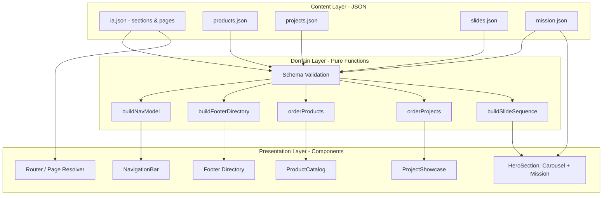

# Design Document

## Overview

This design covers a full front-end redesign of an existing website. The content itself (products, past projects, mission copy) already exists and is considered strong; this feature governs how that content is **structured, organized, and presented**. Structural inspiration is drawn from Tyler Technologies' corporate site: a persistent top navigation bar with dropdown menus, a central hero carousel on the home page, mission statement copy directly beneath the hero, structured presentation of products and projects, and a footer "directory" that acts as a friendly, non-technical sitemap. Site search and login/registration are explicitly excluded.

### Key Design Decision: Content-Driven Architecture

Per the approved direction, the site is **data-driven from a small set of JSON content files** rather than hardcoded markup. Products, projects, hero slides, mission copy, and — critically — the site's information architecture (sections and pages) all live in structured JSON. The navigation dropdowns and the footer directory are both **derived from a single Information Architecture (IA) document**, guaranteeing they stay in sync. Adding a new product, project, or page becomes an edit to a JSON file, not a code change.

This yields three properties we care about:

- **Single source of truth for IA** — nav and footer cannot drift apart because they read the same data.
- **Low-friction content authoring** — a new product/project/page is a JSON entry.
- **Deterministic, testable transformations** — the functions that turn IA data into a nav model and a footer model are pure and can be property-tested.

### Key Design Decision: Adopt Established Standards for the Content Model

Rather than inventing fully bespoke JSON shapes for every content entity, the authored content adopts two widely-used standards. This keeps authoring familiar, improves interoperability, and gives us search-engine benefits "for free" while leaving genuinely app-specific structures (the Information Architecture) under our own control.

- **[Schema.org](https://schema.org) vocabulary for content entities.** Where our entities overlap with well-known types, we align field names with Schema.org so the authored JSON reads like standard structured data and can be emitted as JSON-LD without a translation layer. The relevant types:
  - **[Product](https://schema.org/Product)** — for products (`name`, `description`, `image`, `url`).
  - **[CreativeWork](https://schema.org/CreativeWork)** (a.k.a. Project) — for past projects (`name`, `description`, `image`, `url`, `dateCreated`).
  - **[SiteNavigationElement](https://schema.org/SiteNavigationElement)** — for navigation entries (emitted as an `ItemList` of nav elements).
  - **[WebSite](https://schema.org/WebSite) / [WebPage](https://schema.org/WebPage)** — for the site and its individual pages (the IA/pages layer).

  Only the fields that overlap with Schema.org are renamed; our internal bookkeeping fields (`id`, `slug`, `order`, `detailPageId`, `body`) are kept as-is and are simply not emitted as part of the public structured data.

- **[JSON Schema (draft 2020-12)](https://json-schema.org/specification) as the validation format.** The design already validates every content document with a JSON Schema validator; we make this explicit — the schemas are **authored as JSON Schema draft 2020-12 documents**. The TypeScript-style types shown in Data Models are a readable mirror of those JSON Schema documents.

- **Atomic reusable content blocks (kept).** The existing `ContentBlock` pattern already follows the common headless-CMS convention of composing rich content from small, reusable, typed blocks (as used by Contentful, Sanity, and similar). This convention is retained unchanged; it is orthogonal to the Schema.org alignment above.

**Consequence for SEO:** because authored content already uses Schema.org field names, the site can emit **JSON-LD structured data** (`<script type="application/ld+json">`) derived directly from the authored content at render time — Product for product detail pages, CreativeWork for project detail pages, SiteNavigationElement for navigation, and WebSite/WebPage for pages (see the StructuredData / JSON-LD emission component).

### Goals

- Content and IA driven by validated JSON schemas.
- Accessible, keyboard-operable navigation and carousel.
- Responsive layout down to 320px width, with a collapsible menu below 768px.
- Graceful degradation when individual pieces of content fail to load.

### Non-Goals

- No site-wide search.
- No authentication, login, or registration.
- No creation of new business content (only structuring/presenting existing content).

## Architecture

### High-Level Structure

The site is a component-based front-end application (framework-agnostic in this design; the reference implementation assumes a modern component framework such as React with a router). Content is loaded from JSON, validated against schemas, and transformed by pure functions into view models consumed by presentation components.



### Information Architecture as Single Source of Truth

The `ia.json` document defines the set of top-level sections and the pages within each. Both the Navigation_Bar model and the Footer Directory model are produced from this one document by pure functions:

- `buildNavModel(ia)` → the top-level items and their dropdown children.
- `buildFooterDirectory(ia)` → labeled groups (one per top-level section) with links to every page.

Because both derive from the same input, a page added to or removed from the IA is automatically reflected in both nav and footer. Products and projects reference IA pages by `pageId`, so a product/project detail page can be surfaced in the IA (and thus nav/footer) without duplicating link data.

### Routing and Page Resolution

The router resolves a URL path to a Page defined in the IA. Rules:

- Every Page in the IA has a unique `path`.
- Paths corresponding to `search`, `login`, or `register` are never present in the IA and always resolve to a "page not found" response.
- Product and project detail pages are resolved either from dedicated IA entries or from a parameterized route (`/products/:slug`, `/projects/:slug`) backed by `products.json` / `projects.json`.

### Responsive Behavior

- **≥ 768px**: full horizontal Navigation_Bar with hover/focus dropdowns.
- **< 768px**: a single collapsible menu control (hamburger) toggles all top-level items and their children.
- **≥ 320px**: Navigation_Bar, Footer, and a single-slide Carousel always render.

A shared design-token module (typography family, color palette, heading/body sizes, spacing scale) is applied globally so element types render identically across pages.

## Components and Interfaces

### Content Loader & Validator

Responsible for fetching each JSON document and validating it against its schema. Invalid documents are rejected and surfaced as load errors (see Error Handling). Provides typed, validated data to the domain layer.

```
loadContent(source): Result<ContentBundle, ContentError>
validate(doc, schema): Result<T, ValidationError>
```

### Navigation Bar

- Renders top-level items from `buildNavModel(ia)`.
- Each top-level item either links directly to a page (no children) or opens a dropdown (has children).
- At most one dropdown open at a time; opening a new one closes the current.
- Keyboard support: Tab moves focus, Enter/Space activates, visible focus indicator.
- Marks the current section's parent item with a persistent visual indicator.
- Below 768px collapses to a single toggle control.

Interface:
```
NavModel = {
  items: NavItem[]
}
NavItem =
  | { kind: "link"; label: string; pageId: string; path: string }
  | { kind: "menu"; label: string; sectionId: string; children: NavLink[] }
NavLink = { label: string; pageId: string; path: string }
```

### Hero Section (Carousel + Mission Statement)

- Carousel displays exactly one Slide at a time, cycling 2–10 slides.
- Auto-advances at a fixed interval (5–8s) when idle; wraps from last to first.
- Pauses on interaction/focus; resumes within 8s after interaction ends.
- Prev/next controls and direct slide-target controls.
- Slides that fail to load are excluded from the displayed sequence.
- Mission_Statement renders directly beneath the carousel (≤ 48px gap), always visible, unchanged as slides advance.

Interface:
```
buildSlideSequence(slides: Slide[], failedIds: Set<string>): Slide[]  // excludes failed, preserves order
CarouselState = { current: number; playing: boolean }
advance(state, length): CarouselState   // wraps
goTo(state, index, length): CarouselState
```

### Product Catalog & Detail

- Presents all products in a stable defined order (by explicit `order` field, then id).
- Each card: `name` (≤120 chars), `description` (the Schema.org-aligned summary, ≤300 chars), link to detail page.
- Empty state message when no products.
- Detail page renders existing content; unavailable content keeps current page and shows a message.

### Project Showcase & Detail

- Presents all projects ordered most-recently-added first (by `dateCreated` descending, tie-broken by id).
- Each card: `name` (≤120 chars), `description` (≤300 chars), link to detail page.
- Empty state message when no projects.
- Detail behavior mirrors products.

### StructuredData / JSON-LD Emission

Derives Schema.org JSON-LD from authored content and emits it into the page as a `<script type="application/ld+json">` block at render time. Because the authored Product/Project fields are already Schema.org-aligned, this is a thin derivation (map internal fields out, attach `@context`/`@type`) rather than a translation layer.

- **Product detail page** → a `Product` JSON-LD object (`name`, `description`, `image`, `url`).
- **Project detail page** → a `CreativeWork` JSON-LD object (`name`, `description`, `image`, `url`, `dateCreated`).
- **Navigation** → an `ItemList` of `SiteNavigationElement` entries, one per nav link (`name`, `url`).
- **Any page** → a `WebPage` object, and the site root additionally carries a `WebSite` object (`name`, `url`).

Interface:
```
type JsonLd = { "@context": "https://schema.org"; "@type": string; [k: string]: unknown };

toProductJsonLd(product: Product): JsonLd            // @type: "Product"
toCreativeWorkJsonLd(project: Project): JsonLd       // @type: "CreativeWork"
toSiteNavigationJsonLd(nav: NavModel): JsonLd        // @type: "ItemList" of SiteNavigationElement
toWebPageJsonLd(page: PageRef): JsonLd               // @type: "WebPage"
toWebSiteJsonLd(site: SiteInfo): JsonLd              // @type: "WebSite"
renderJsonLdScript(data: JsonLd): string             // <script type="application/ld+json">...</script>
```

These functions are pure (authored content in, JSON-LD out) and are therefore property-testable.

### Footer Directory

- Renders `buildFooterDirectory(ia)`: one labeled group per top-level section, each containing a link to every page in that section.
- Group labels are the human-readable, non-technical section labels from the IA.
- Present on every page.

Interface:
```
FooterDirectory = { groups: FooterGroup[] }
FooterGroup = { label: string; sectionId: string; links: FooterLink[] }
FooterLink = { label: string; pageId: string; path: string }
```

## Data Models

All content lives in JSON documents that are **authored as JSON Schema (draft 2020-12)** documents and validated with a JSON Schema validator. The types below are expressed as TypeScript-style types for readability; each is a direct mirror of its underlying JSON Schema (draft 2020-12) document — for example, the Product schema declares `"$schema": "https://json-schema.org/draft/2020-12/schema"`, `"type": "object"`, the `required` fields, and `maxLength` bounds noted inline.

Where our entities overlap with Schema.org types, the **public field names are aligned with Schema.org** (Product, CreativeWork, SiteNavigationElement, WebSite/WebPage). Internal bookkeeping fields (`id`, `slug`, `order`, `detailPageId`, `body`) are kept and are not part of the emitted structured data.

### Information Architecture (`ia.json`)

The single source of truth for sections and pages, and genuinely app-specific — so it remains our own shape rather than a Schema.org type. Nav and footer both derive from this. Individual pages can additionally carry Schema.org **WebPage** semantics when emitted as JSON-LD (see StructuredData / JSON-LD emission).

```ts
type IA = {
  defaultSectionId: string;      // fallback section for unmapped pages
  sections: Section[];
};

type Section = {
  id: string;                    // stable machine id, e.g. "products"
  label: string;                 // human-readable, non-technical, e.g. "What We Offer"
  order: number;                 // display order among top-level items
  pages: PageRef[];
};

type PageRef = {
  id: string;                    // unique page id across the whole IA
  label: string;                 // link/menu label
  path: string;                  // unique URL path, e.g. "/products/atlas"
  showInNav?: boolean;           // default true
  showInFooter?: boolean;        // default true
};
```

Constraints (enforced by validation):
- Every `PageRef.id` is unique across all sections.
- Every `PageRef.path` is unique across the IA.
- Each page belongs to exactly one section.
- `defaultSectionId` references an existing section.
- No `path` equals a reserved excluded path (`/search`, `/login`, `/register`).

### Products (`products.json`)

Aligned with Schema.org [Product](https://schema.org/Product). Public fields (`name`, `description`, `image`, `url`) map directly to Schema.org; the former `summary` field is now `description`. Internal fields are retained.

```ts
type Product = {
  // Schema.org Product-aligned (public / emitted as JSON-LD)
  name: string;                  // <= 120 chars  (schema.org: name)
  description: string;           // <= 300 chars  (schema.org: description; was "summary")
  image?: string;                // schema.org: image (URL)
  url?: string;                  // schema.org: url (canonical URL)

  // Internal bookkeeping (not emitted as structured data)
  id: string;                    // stable id
  slug: string;                  // URL slug -> detail path /products/{slug}
  order: number;                 // stable ordering key
  detailPageId: string;          // references PageRef.id in ia.json
  body?: ContentBlock[];         // existing detail content (atomic reusable blocks)
};
```

### Projects (`projects.json`)

Modeled as Schema.org [CreativeWork](https://schema.org/CreativeWork). The former `title` is now `name`, `summary` is now `description`, and `addedAt` is now `dateCreated` (ISO 8601), which remains the recency ordering key. Internal fields are retained.

```ts
type Project = {
  // Schema.org CreativeWork-aligned (public / emitted as JSON-LD)
  name: string;                  // <= 120 chars  (schema.org: name; was "title")
  description: string;           // <= 300 chars  (schema.org: description; was "summary")
  image?: string;                // schema.org: image (URL)
  url?: string;                  // schema.org: url (canonical URL)
  dateCreated: string;           // ISO 8601; schema.org: dateCreated; ordering key (desc); was "addedAt"

  // Internal bookkeeping (not emitted as structured data)
  id: string;
  slug: string;                  // URL slug -> detail path /projects/{slug}
  detailPageId: string;          // references PageRef.id in ia.json
  body?: ContentBlock[];         // atomic reusable blocks
};
```

### Slides (`slides.json`)

```ts
type Slide = {
  id: string;
  image: { src: string; alt: string };
  heading: string;
  text?: string;
  cta?: { label: string; pageId: string; path: string };  // optional call-to-action
};

type SlideDeck = {
  slides: Slide[];               // length 2..10 after validation
  intervalSeconds: number;       // 5..8 inclusive
};
```

### Mission (`mission.json`)

```ts
type Mission = {
  heading: string;
  body: ContentBlock[];          // existing mission and value copy
};
```

### Shared Content Block

```ts
type ContentBlock =
  | { type: "paragraph"; text: string }
  | { type: "heading"; level: 2 | 3 | 4; text: string }
  | { type: "image"; src: string; alt: string }
  | { type: "list"; items: string[] };
```

### Derived (non-authored) Models

`NavModel`, `FooterDirectory`, and the ordered product/project/slide sequences are **computed** from the authored JSON above and are never authored directly.

## Correctness Properties

*A property is a characteristic or behavior that should hold true across all valid executions of a system — essentially, a formal statement about what the system should do. Properties serve as the bridge between human-readable specifications and machine-verifiable correctness guarantees.*

The properties below focus on the **pure, data-driven core** of the design — the transformations that turn JSON content and the Information Architecture into nav models, footer directories, ordered lists, carousel state, and route resolutions. UI-only concerns (pixel layout, focus visibility, timing) are covered by example/interaction tests in the Testing Strategy rather than by properties.

### Property 1: Navigation derivation mirrors the Information Architecture

*For any* valid IA, `buildNavModel(ia)` produces top-level items that correspond one-to-one with the nav-visible sections of the IA (preserving section order); a section with exactly one nav-visible page yields a `link` item pointing to that page's path, and a section with two or more nav-visible pages yields a `menu` item whose children are exactly those pages.

**Validates: Requirements 1.2, 2.1, 2.5**

### Property 2: Footer directory mirrors the Information Architecture

*For any* valid IA, `buildFooterDirectory(ia)` produces groups that correspond one-to-one with the IA sections, where each footer-visible page appears exactly once, in the group of the section that owns it, with no missing and no extra pages, and each group's label equals its section's human-readable `label` (never the machine `id`).

**Validates: Requirements 7.2, 7.3, 7.4, 7.7, 7.8**

### Property 3: Every page belongs to exactly one section

*For any* valid IA, each page id appears in exactly one section's page list.

**Validates: Requirements 2.2**

### Property 4: At most one dropdown menu is open

*For any* sequence of "open menu" actions applied to the navigation open-state reducer, the number of simultaneously open dropdown menus is always at most one, and after opening a given menu that menu is the open one.

**Validates: Requirements 1.5**

### Property 5: Active-section computation matches the owning section

*For any* valid IA and any page in it, the computed active top-level section for that page equals the section that contains the page.

**Validates: Requirements 1.7**

### Property 6: Carousel always displays exactly one in-range slide

*For any* valid slide deck and any sequence of carousel actions (advance, previous, goTo), the carousel state has exactly one current slide index and that index is within the range of available slides.

**Validates: Requirements 3.2, 9.5, 9.6**

### Property 7: Carousel transitions are correct (wrap and target)

*For any* slide deck of length n and any index i, advancing at the last slide returns to the first slide (advancing n times returns to i), and `goTo(state, target)` for any in-range target sets the current index to that target.

**Validates: Requirements 3.5, 3.6**

### Property 8: Failed slides are excluded while order is preserved

*For any* slide list and any subset of failed slide ids, `buildSlideSequence` returns exactly the slides whose ids are not in the failed set, in their original relative order, containing none of the failed slides.

**Validates: Requirements 3.11**

### Property 9: Content validation enforces all declared bounds

*For any* generated content, validation (JSON Schema draft 2020-12) accepts it if and only if: the slide deck length is between 2 and 10 inclusive, the auto-advance interval is between 5 and 8 seconds inclusive, every product `name` and project `name` is at most 120 characters, and every product and project `description` is at most 300 characters.

**Validates: Requirements 3.3, 3.4, 5.2, 6.2**

### Property 10: Product ordering is a stable permutation

*For any* set of products, `orderProducts` returns a permutation containing exactly the same products (same multiset), deterministically ordered by ascending `order` then by `id`.

**Validates: Requirements 5.1**

### Property 11: Project ordering is a recency permutation

*For any* set of projects, `orderProjects` returns a permutation containing exactly the same projects, ordered so that for every adjacent pair the earlier one has a `dateCreated` greater than or equal to the later one (ties broken deterministically by `id`), i.e. most-recently-added first.

**Validates: Requirements 6.1**

### Property 12: Cards render all required fields and a detail link

*For any* product or project, the rendered card contains its `name`, its `description`, and a link whose target resolves to that item's detail page.

**Validates: Requirements 5.2, 6.2**

### Property 14: JSON-LD derivation is well-formed and reflects authored content

*For any* authored product or project, the emitted JSON-LD is well-formed — its `@context` is `"https://schema.org"` and its `@type` is `"Product"` for products and `"CreativeWork"` for projects — and it reflects the authored content: every present Schema.org-aligned field (`name`, `description`, and any `image`/`url`, plus `dateCreated` for projects) appears in the output unchanged, while internal-only fields (`id`, `slug`, `order`, `detailPageId`, `body`) never appear. Likewise, *for any* navigation model, the emitted structured data is an `ItemList` of `SiteNavigationElement` entries corresponding one-to-one (with `name` and `url`) to the model's nav links.

**Validates: Requirements 5.2, 6.2, 6.1**

### Property 13: Reserved paths resolve to not-found

*For any* valid IA (which by validation never contains a reserved path) and any path in the reserved set (search, login, registration paths), `resolveRoute` returns a not-found result and never exposes search, login, or registration functionality.

**Validates: Requirements 8.5**

## Error Handling

Errors are handled so that a failure in one piece of content never blanks the whole page.

### Content Loading & Validation Errors

- **Invalid JSON / schema violation**: The content loader rejects the document and reports a `ContentError`. In development this fails loudly (build/test error); in production the affected region renders its defined fallback (empty-state or placeholder) rather than crashing the page.
- **Reserved path present in IA**: Validation fails — the IA must never define `/search`, `/login`, or `/register`. This is enforced at validation time (supports Requirement 8.5).

### Carousel

- **Slide fails to load** (3.11): The slide is excluded via `buildSlideSequence`; remaining slides continue to display. If exclusions drop the deck below the minimum, the carousel renders whatever valid slides remain (never fewer than one) and stops auto-advancing if only one remains.

### Mission Statement

- **Mission copy unavailable** (4.4): Render placeholder text ("Mission content is temporarily unavailable") while preserving the reserved layout space beneath the carousel so the page does not shift.

### Product / Project Detail

- **Detail content unavailable** (5.5, 6.5): Do not navigate away. Remain on the current page and surface a non-blocking message that the item's details cannot be displayed.
- **Empty catalog/showcase** (5.6, 6.6): Render an explicit empty-state message rather than an empty region.

### Routing

- **Unknown / removed page** (7.6): The router returns a "page not found" response (a real 404 page using the site's layout, with nav and footer) rather than a blank or broken page.
- **Reserved paths** (8.5): Always resolve to not-found.

## Testing Strategy

The design uses a **dual approach**: property-based tests for the pure data-driven core, and example/interaction tests for UI behavior, timing, layout, and routing wiring.

### Property-Based Testing

Property-based testing IS appropriate here because the core of the design is a set of pure functions over structured input: IA → nav model, IA → footer directory, content → validation result, product/project sets → ordered lists, slide list + failed set → sequence, and carousel state transitions. These have large input spaces and clear universal properties (permutations, invariants, round-trips, error conditions).

Guidelines:
- Use an established property-based testing library for the target language (e.g., **fast-check** for TypeScript/JavaScript). Do not hand-roll property testing.
- Each property in the Correctness Properties section is implemented by a **single** property-based test.
- Each property test runs a **minimum of 100 iterations**.
- Each property test is tagged with a comment referencing its design property, using the format:
  `Feature: website-redesign, Property {number}: {property_text}`
- Custom generators:
  - **IA generator**: produces valid IAs — unique page ids and paths, each page in exactly one section, a valid `defaultSectionId`, and no reserved paths. A variant deliberately injects pages with missing/unknown sections to exercise the default-section fallback (edge case 2.6).
  - **Product/Project generators**: vary `order`/`dateCreated`, produce both within-bounds and over-bounds `name`/`description` lengths for the validation property (P9), and vary presence of optional Schema.org fields (`image`, `url`) to exercise JSON-LD derivation (P14).
  - **Slide deck generator**: varies deck length (including below 2 and above 10) and interval (including outside 5–8) for validation, and produces failed-id subsets for the exclusion property (P8).
  - **Carousel action-sequence generator**: random sequences of advance/previous/goTo to exercise the single-slide invariant (P6) and transitions (P7).

Properties P1–P14 map to tests as follows: nav derivation (P1), footer derivation (P2), IA page-uniqueness invariant (P3), dropdown open-state (P4), active section (P5), carousel invariant (P6), carousel transitions (P7), slide exclusion (P8), validation bounds (P9), product ordering (P10), project ordering (P11), card rendering (P12), reserved-path routing (P13), JSON-LD derivation (P14).

### Example-Based Unit & Interaction Tests

Cover concrete behaviors, timing, layout, accessibility, and wiring that are not universal properties:

- **Navigation interaction**: dropdown opens on click/Enter/Space (1.3), link items navigate (1.4), selecting a dropdown link navigates and closes it (1.6), focus indicator + Tab/Enter/Space keyboard operation (1.8).
- **Section placement wiring**: products render under the Products section (2.3), projects under the Projects section (2.4).
- **Carousel timing** (with fake timers): auto-advance interval behavior (3.4 timing), pause on interaction/focus (3.7), resume within 8s (3.8), CTA navigation (3.9), prev/next controls present (3.10).
- **Hero layout**: hero at top of home (3.1), mission directly beneath carousel with ≤48px gap (4.1), mission visible without interaction (4.2), mission unchanged as slides advance (4.3), mission placeholder + reserved space when unavailable (4.4).
- **Detail pages**: product/project selection navigates (5.3, 6.3), detail renders existing content (5.4, 6.4), unavailable detail stays put with a message (5.5, 6.5), empty-state messages (5.6, 6.6).
- **Footer**: footer present on every page (7.1), directory links navigate (7.5), unavailable link → 404 page (7.6).
- **Excluded features**: no search inputs (8.1), no login controls (8.2), no registration controls (8.3), pages load without auth prompt (8.4).
- **Responsiveness & theming**: consistent style attributes across pages (9.1), nav+footer present with working links at ≥320px (9.2), collapsible menu below 768px (9.3), collapsible toggle shows/hides (9.4).

### Integration / Smoke

- Route resolution against the real IA for a representative set of paths (valid pages + reserved paths).
- Snapshot test of the composed home page (hero + mission + sections + footer).
- A build-time validation smoke check that all shipped JSON content passes its schemas.
